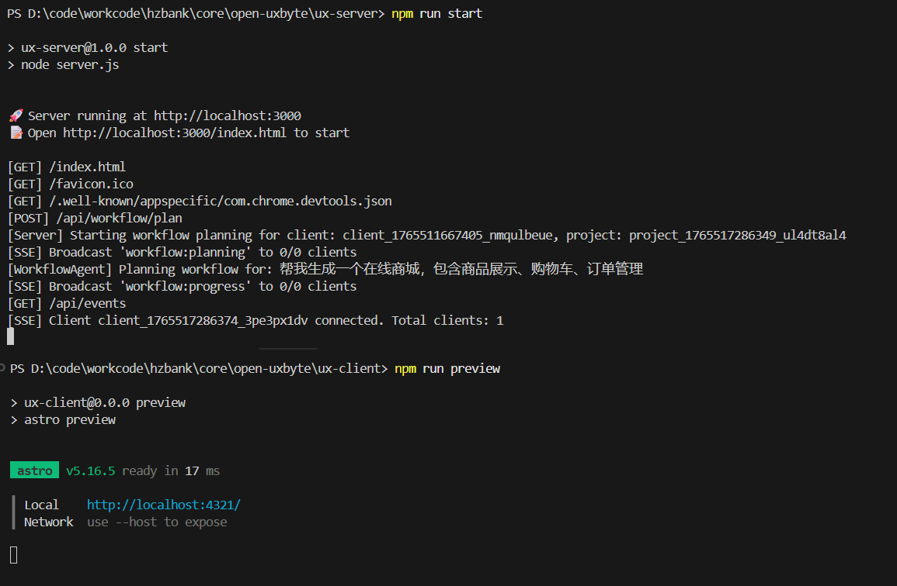
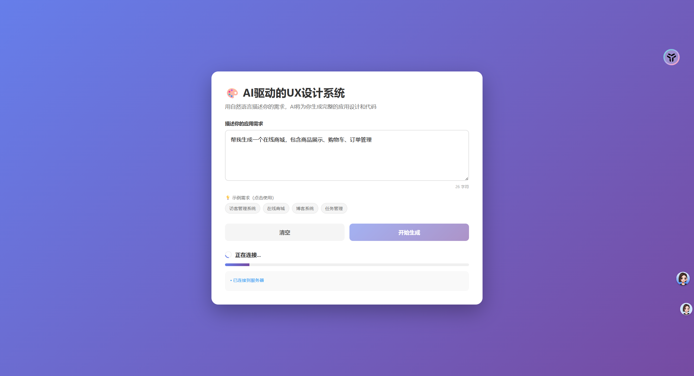
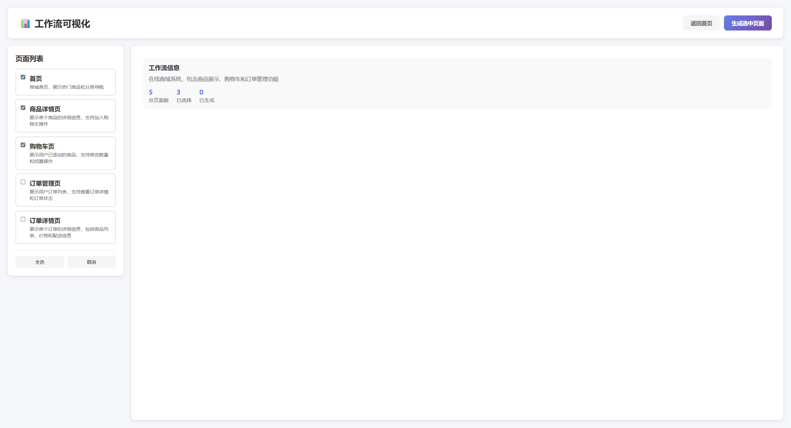
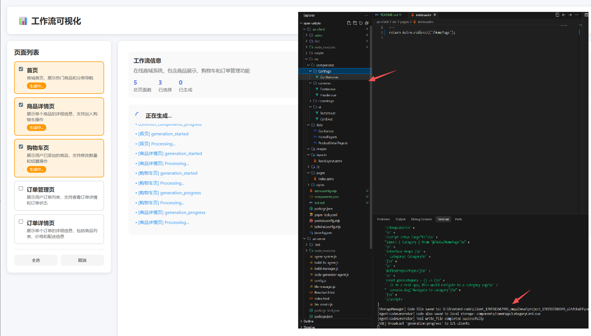
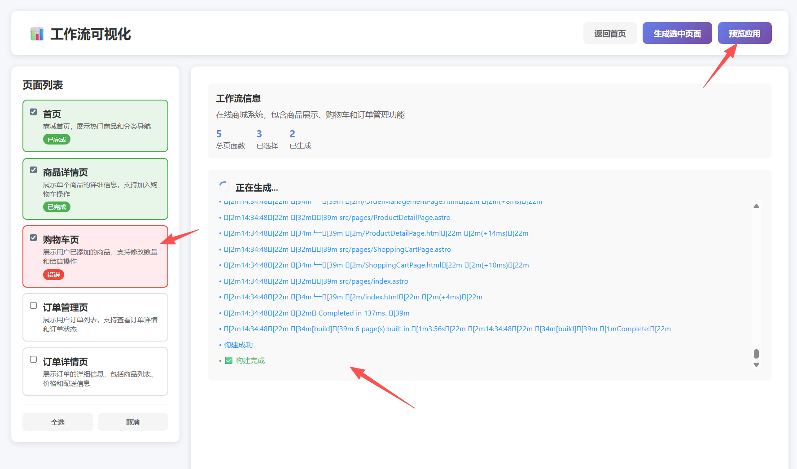
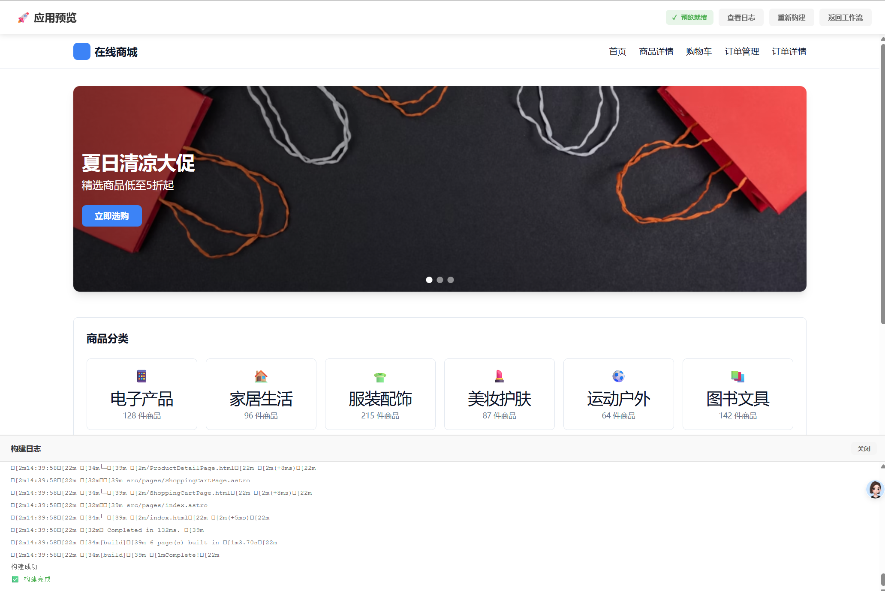
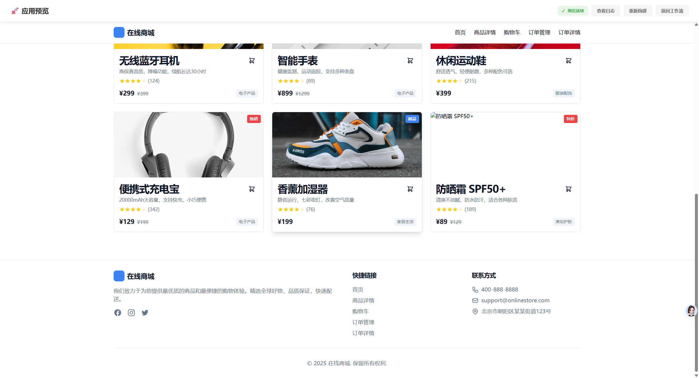
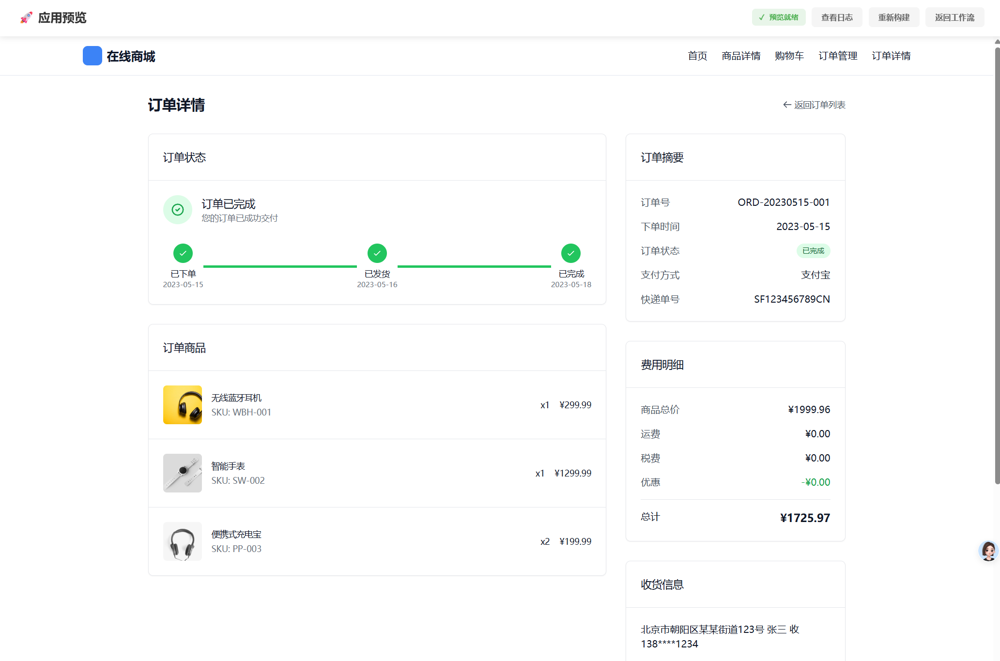
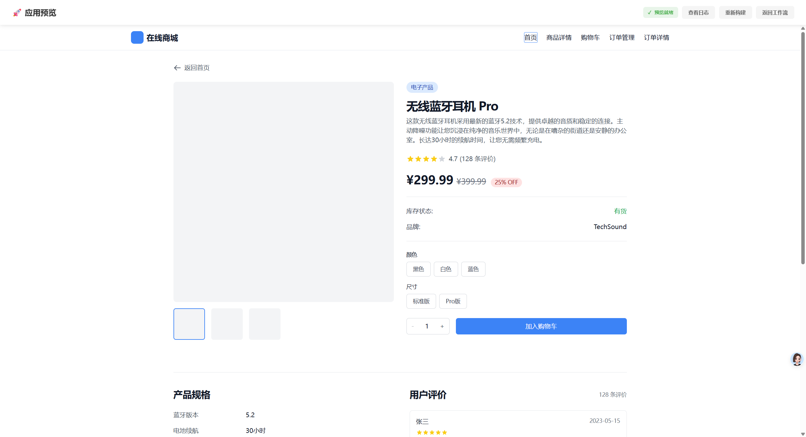
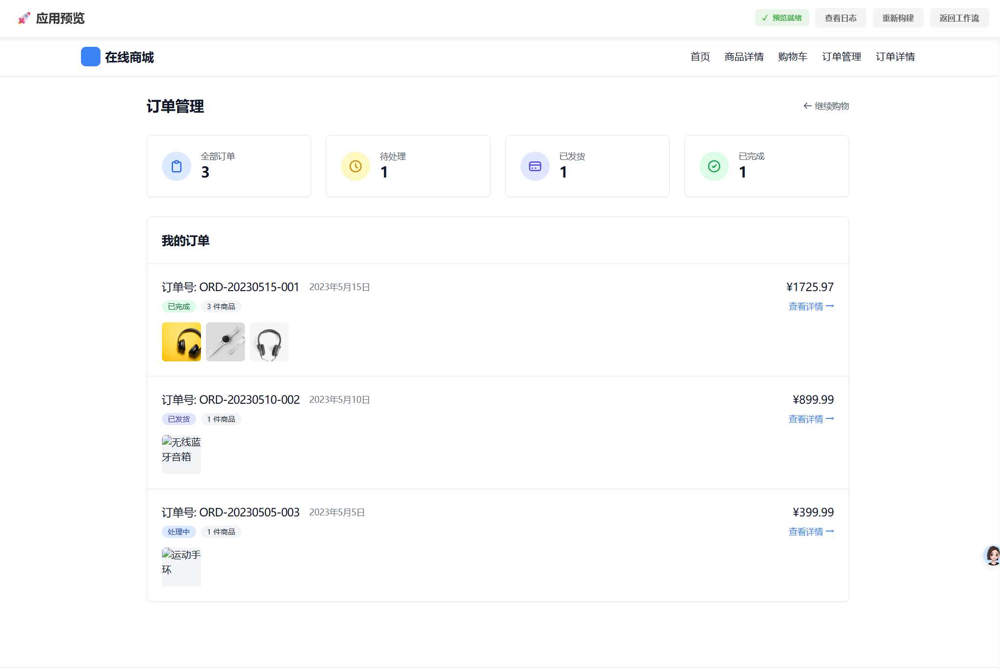

# AI-Driven UX Design System

一个通过自然语言生成UX设计稿并转换成Vue代码的AI驱动系统，可直接用于生产级部署。

## 功能特性

- 🎨 **自然语言输入**: 用简单的中文描述你的应用需求
- 🤖 **AI智能规划**: 自动分析需求并生成页面结构和工作流
- 📊 **可视化工作流**: 直观展示页面关系和导航流程
- ⚡ **并行代码生成**: 同时生成多个页面的Vue组件代码
- 🔄 **实时进度跟踪**: 通过SSE实时显示生成进度
- 👀 **即时预览**: 自动构建并预览生成的应用
- 🚀 **生产就绪**: 生成的代码可直接用于生产环境

## 技术栈

### 服务端
- **Node.js** - 原生HTTP服务器(无Express)
- **Server-Sent Events (SSE)** - 实时进度推送
- **Agent系统** - 工作流规划和代码生成
- **LLM集成** - DeepSeek模型支持

### 前端
- **Vue 3** - Composition API
- **Astro** - 静态站点生成
- **Tailwind CSS** - 样式框架

## 预览效果

启动命令

workflowAgent 会规划页面的组织结构

规划完成可以勾选页面进行并发生成

会先依照提示词生成通用组件、ui组件，然后生成页面，当页面生成失败后会尝试重新生成， 整个过程是自动化的，不出意外的话在生成完后会自动打包，如果打包失败build-manager会调用 build-fix-agent 自动修复打包错误 重新打包，你只需要点击右上角预览按钮即可。

构建错误会自动修复

构建错误有5次尝试修复错误，修复成功后会自动打包， 点击预览应用





最终效果
## 快速开始

### 1. 安装依赖

```bash
# 安装服务端依赖
cd ux-server
npm install

# 安装客户端依赖
cd ../ux-client
npm install
```

### 2. 启动服务器

```bash
cd ux-server
npm start
```

服务器将在 `http://localhost:3000` 启动

### 3. 使用系统

1. 打开浏览器访问 `http://localhost:3000/index.html`
2. 输入你的应用需求，例如："帮我生成一个访客管理系统"
3. 等待AI规划工作流
4. 在工作流页面选择要生成的页面
5. 点击"生成选中页面"
6. 等待代码生成和构建完成
7. 在预览页面查看生成的应用

## 系统架构

```
ux-server/
├── server.js              # 主HTTP服务器
├── config.js              # 配置文件
├── llm-service.js         # LLM服务封装
├── sse-manager.js         # SSE连接管理
├── file-manager.js        # 文件操作管理
├── agent-system.js        # Agent基础框架
├── workflow-agent.js      # 工作流规划Agent
├── code-generator-agent.js # 代码生成Agent
├── build-manager.js       # 构建管理
├── preview-server.js      # 预览服务器
├── index.html             # 主页面
├── flowchart.html         # 工作流可视化
└── preview.html           # 预览页面

ux-client/
├── src/
│   ├── pages/            # 生成的Astro页面
│   └── components/       # 生成的Vue组件
└── dist/                 # 构建输出
```

## API端点

### 工作流管理
- `POST /api/workflow/plan` - 规划工作流
- `POST /api/workflow/generate` - 生成页面代码
- `GET /api/workflow/status` - 获取工作流状态

### 构建和预览
- `POST /api/build` - 触发构建
- `POST /api/preview/start` - 启动预览服务器
- `GET /api/preview/status` - 获取预览状态

### 实时事件
- `GET /api/events` - SSE事件流

## 配置

编辑 `ux-server/config.js` 修改配置：

```javascript
{
  server: {
    port: 3000,
    host: 'localhost'
  },
  llm: {
    host: 'http://158.2.130.21:9997',
    model: 'deepseek-reason',
    temperature: 0.7
  },
  // ... 更多配置
}
```

## Agent工具

系统提供以下工具供Agent使用：

- `write_file(path, content)` - 写入文件到ux-client/src
- `read_file(path)` - 读取文件
- `list_files(directory)` - 列出目录文件

## 工作流程

1. **需求分析**: 用户输入自然语言描述
2. **工作流规划**: AI分析需求，生成页面结构和关系
3. **页面选择**: 用户选择要生成的页面
4. **代码生成**: AI并行生成Vue组件和Astro页面
5. **自动构建**: 使用Astro构建静态站点
6. **预览部署**: 启动预览服务器展示结果

## 示例需求

- "帮我生成一个访客管理系统"
- "帮我生成一个在线商城，包含商品展示、购物车、订单管理"
- "帮我生成一个博客系统，包含文章列表、文章详情、分类管理"
- "帮我生成一个任务管理系统，包含任务列表、任务详情、进度跟踪"

## 注意事项

- 确保LLM服务可访问
- 生成的代码会写入 `ux-client/src` 目录
- 构建过程需要Node.js和npm环境
- 首次构建可能需要较长时间

## 许可证

MIT
